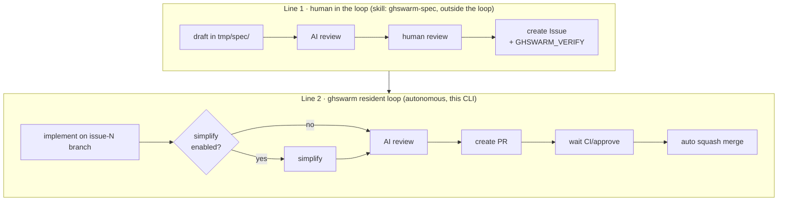
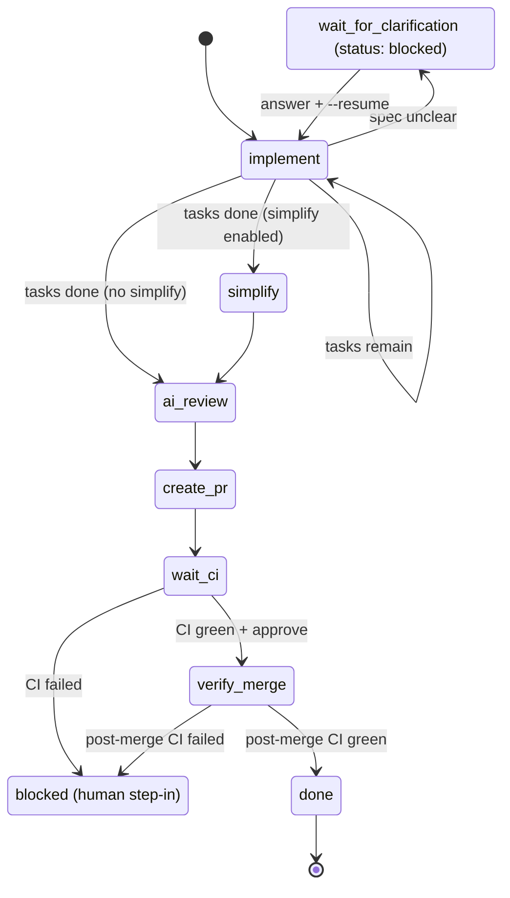

# ghswarm

[](https://github.com/toyama0919/ghswarm/actions/workflows/ci.yml)
[](https://pypi.org/project/ghswarm/)
[](https://pypi.org/project/ghswarm/)
[](LICENSE)

A development-PM agent that, on a foundation of **spec-driven development**, treats GitHub Issues as "state"
and **orchestrates multiple coding CLIs** (Claude Code / Codex / Cursor)
**with mutual exclusion enforced via labels**.

It runs no server (no Webhook/FastAPI); all state is persisted on GitHub (labels + metadata in the Issue body +
checkboxes). The spec prose and verify steps also live in the Issue body (`GHSWARM_VERIFY`). Even if the process dies, reading the Issue lets it **resume from where it left off**.

## Two-line architecture



- **Line 1** is handled by the Claude Code skill [`ghswarm-spec`](.claude/skills/ghswarm-spec/SKILL.md).
  The spec draft is placed in `tmp/spec/` to await human approval; after approval the prose, task checklist, and
  `GHSWARM_VERIFY` block are written into a GitHub Issue. No spec file is committed and no spec PR is opened.
- **Line 2** is ghswarm itself. It cuts branch `issue-N`, implements, opens a PR with `Refs #N`, and drives it to auto-merge.

## Design highlights

- **Mutual exclusion via labels** — `status: busy-<agent>` / `idle` / `blocked` / `completed`.
  Only one CLI runs at a time within the same repository. The lock lives on GitHub, so it is shared across processes.
- **State persisted in the Issue body** — saved as JSON in an HTML comment at the top of the body
  (`<!-- GHSWARM_STATE_START ... GHSWARM_STATE_END -->`), holding `next_action` / `branch_name` / `pr_number` and so on.
  Verify steps live in a separate `<!-- GHSWARM_VERIFY_START ... GHSWARM_VERIFY_END -->` block so they survive every state rewrite.
- **Progress via checkboxes** — `- [ ] task` items in the Issue body are worked through and updated to `- [x]`. Incomplete tasks are
  **handed to a single CLI run all at once** (because each CLI is a one-shot headless invocation that loses its context every time,
  launching one per task would force it to re-read the codebase). Once verify passes, all items are checked.
- **Spec-driven** — the Issue body prose (with `GHSWARM_STATE` and `GHSWARM_VERIFY` stripped) is injected into each implement/review prompt. The agent follows the spec.
- **CLI/model fixed per phase** — the CLI and model used in the `implement` / `review` phases (and optionally `simplify`) are specified explicitly
  in the config (the `command` under `agents.implement` / `agents.review` / `agents.simplify`). There is no dynamic routing by an LLM.
- **Self-healing** — CLI run → tests → on failure, retry with the log attached (up to N times). If that fails, `git reset --hard`
  rolls back, sets `status: blocked`, and escalates to a human.
- **Clarification** — if the spec is unclear during implementation, the agent writes `.agent_question.md` and exits. ghswarm comments on the Issue,
  sets `status: blocked`, and once an answer is posted it resumes with `--resume`.
- **CI/approve gate → auto-merge → post-merge CI gate** — after the PR is created, it polls as `wait_ci`.
  Once all CI succeeds and the PR review is approved (`require_approval`), it squash-merges. On CI failure it blocks.
  When `mergeable=CONFLICTING`, it merges `origin/<base_branch>` in the worktree to auto-resolve, then
  re-runs CI after pushing (can be disabled with `auto_resolve_conflicts`).
  After merging it does not close the Issue but proceeds to `verify_merge`, closing the Issue only when the CI of the merge
  commit on the merge target branch (`base_branch`) is green (regression detection; can be disabled with `post_merge_ci`).
- **blocked notifications** — when transitioning to `blocked` or awaiting clarification, it pushes to a configured Slack webhook or
  macOS notification (the `notify` section, disabled by default). Consecutive re-transitions for the same reason are suppressed, and
  a re-block after leaving blocked notifies again. Send failures only produce a warning log; the main process continues.

## State machine (Line 2)



## Installation

```bash
uv tool install ghswarm      # recommended (isolated CLI install)
# or: pipx install ghswarm
# or: pip install ghswarm
```

From source (for development):

```bash
git clone https://github.com/toyama0919/ghswarm && cd ghswarm && uv sync --extra dev
```

Prerequisites: `gh` (already `gh auth login`ed), and each coding CLI you use being authenticated and able to run headless.

### Claude Code skills

ghswarm ships its user-facing Claude Code skills with the package, so they always match the
installed CLI version. Install them into Claude Code with:

```bash
ghswarm skills install            # -> ~/.claude/skills (available in any repo)
ghswarm skills install --project  # -> ./.claude/skills (this repo only)
ghswarm skills install --force    # overwrite/update already-installed skills
```

- `ghswarm-requirements` — Line 0 (optional): consult on requirements before drafting, then hand off to `ghswarm-spec`.
- `ghswarm-spec` — Line 1: draft a spec, review it, and file a GitHub Issue with `GHSWARM_VERIFY`.
- `ghswarm-check` — diagnose Issues stuck at `status: blocked` and return safe ones to `idle`.

Re-run `ghswarm skills install --force` after upgrading ghswarm to pull in the latest skill versions.

From a checkout you can also install them with the [`skills`](https://github.com/vercel-labs/skills) CLI:

```bash
npx skills add ./ghswarm --skill ghswarm-spec --skill ghswarm-check --skill ghswarm-requirements --agent claude-code
```

Maintainer-only skills (e.g. `ghswarm-release`, which publishes ghswarm itself to PyPI) are **not**
shipped with the package. They live under this repository's `.claude/skills/` and are available
automatically as project-scoped skills when working inside the ghswarm repo.

## Setup

```bash
ghswarm init && $EDITOR ~/.ghswarm.yaml   # edit repositories / agents, etc.
```

### Config file lookup order

Only the first file found is used (no merging).

1. `--config <path>` (explicit)
2. `~/.ghswarm.yaml`
3. `~/.ghswarm.yml`

Config is **centralized in `~/.ghswarm.yaml` at home**. Declare multiple repositories under `repositories:` as a
mapping keyed by alias, and put shared settings under `defaults:`. Each repo entry requires
`repo` (owner/repo) and `path` (local clone).

`max_parallel_repos` limits the number of repos run concurrently during `loop` (default 3).

`daemon_log` / `daemon_pid` set the log base path and PID file for daemon residency (defaults are
`~/.ghswarm/ghswarm.log` / `~/.ghswarm/ghswarm.pid`). When started with `-d`, the start date
`-YYYY-MM-DD` is inserted just before the log base name's extension (e.g. `~/.ghswarm/ghswarm-2026-07-18.log`). No rotation is done.

### Event log (for observation)

The result of each step (`action` / `detail`) is, by default, also recorded in SQLite at `~/.ghswarm/events.db`
(changeable via `event_db`, empty string disables it). **The labels and Issue body on GitHub are the source of truth**,
and the event DB is derived data for observation/auditing (losing it does not affect resumability). Do not lean state on the DB.

`dry_run` and `action=skipped` (passes such as lock held / waiting on CI) are not recorded. There is no fixed aggregation command
(such as `metrics`); the intent is to accumulate raw events and later have an AI skill write SQL for ad-hoc analysis.

In v1, `ghswarm history` **only opens a single DB** (when `-r` is unspecified, the `event_db` of the first repo).
If you split `event_db` per repo, events from other DBs are not visible from `history`.

If you place `event_db` inside the repository, add `*.db` / `*.db-wal` / `*.db-shm` to `.gitignore`
(not needed under the default `~/.ghswarm/`).

## Config reference

A list of all keys. For a template, see [`config.example.yaml`](src/ghswarm/config.example.yaml) (`ghswarm init` copies it
to `~/.ghswarm.yaml`). Within string values, `${VAR}` / `${VAR:-default}` expand to environment variables
(`${VAR}` errors if unset, `${VAR:-default}` uses default when unset).

The shared settings under `defaults:` and each `repositories.<alias>` entry are **deep-merged key by key**
(nested mappings merge recursively; scalars/lists are replaced by the repo side). The RepoConfig items below can be written
in `defaults:` as well as in each repo entry.

### Top level

| Key | Default | Description |
| --- | --- | --- |
| `repositories` | (required) | Mapping of repo configs keyed by alias. Select with `-r <alias>` |
| `defaults` | `{}` | Fallback shared by all repos (takes the RepoConfig items below) |
| `max_parallel_repos` | `3` | Upper bound on repos run concurrently during `loop` (1 or more) |
| `daemon_log` | `~/.ghswarm/ghswarm.log` | Log base path for `loop -d` (start date `-YYYY-MM-DD` is appended) |
| `daemon_pid` | `~/.ghswarm/ghswarm.pid` | PID file for `loop -d` |

### repositories.&lt;alias&gt; (= RepoConfig; can also go in `defaults`)

| Key | Default | Description |
| --- | --- | --- |
| `repo` | (required) | GitHub `owner/repo` |
| `path` | (required) | Absolute path to the local clone (`~` allowed) |
| `base_branch` | `""` | The PR's merge target. Work branches are also cut from here. Empty means auto-detect via `gh` |
| `branch_prefix` | `"issue-"` | Prefix for work branch names (`issue-N`) |
| `poll_interval` | `60` | Polling interval for `loop` (seconds) |
| `question_file` | `".agent_question.md"` | File the agent writes clarifications to |
| `merge_method` | `"squash"` | `squash` / `merge` / `rebase` |
| `require_approval` | `true` | Whether auto-merge requires a PR review approval |
| `address_pr_reviews` | `true` | Whether to have the review agent address PR review comments (human / bot) |
| `resolve_review_threads` | `true` | After addressing review feedback, mark the corresponding PR review threads as resolved |
| `delete_branch_on_merge` | `true` | Whether to delete the work branch after merge |
| `post_merge_ci` | `true` | Whether to confirm the base branch's CI is green after merge before closing the Issue |
| `post_merge_ci_grace` | `180` | Grace before treating post-merge CI as "no CI" when there are 0 checks (seconds) |
| `worktree_dir` | `""` | Location for per-issue git worktrees. Empty means `../<repo-name>-worktrees` |
| `worktree_setup` | `""` | Command run once, immediately after a worktree is newly created |
| `auto_resolve_conflicts` | `true` | Whether to merge base to auto-resolve when the PR is CONFLICTING |
| `conflict_max_retries` | `3` | Retry cap for conflict resolution across loops |
| `auto_fix_ci` | `true` | Whether to fetch logs on PR CI failure and auto-fix in implement |
| `ci_fix_max_retries` | `3` | Retry cap for CI fixes across loops |
| `transient_error_patterns` | default pattern set | Regexes treated as transient errors (case-insensitive). `resource_exhausted` / `rate limit` / `\b(429\|503)\b`, etc. |
| `transient_max_retries` | `5` | Retry cap for transient errors across loops |
| `max_retries` | `3` | Self-healing retry cap within a single run |
| `issue_max_agent_runs` | `10` | Cumulative agent-run cap per Issue. `0` means unlimited |
| `lock_ttl` | `14400` | Absolute TTL of the busy lock (seconds). On the same host, pid check takes precedence |
| `event_db` | `~/.ghswarm/events.db` | SQLite path for the structured event log. Empty string disables it |
| `activity_dir` | `~/.ghswarm/activity` | Location for activity files while the daemon runs. Empty string disables it |
| `env` | `{}` | Environment variables injected into `gh` calls for this repo (`~` expansion applies) |
| `agents` | (required) | Phase → CLI invocation definition (below) |
| `labels` | defaults below | Status label names |
| `target` | `{}` | Filter conditions for the Issues to pick up |
| `notify` | all disabled | Push notifications for blocked, etc. |
| `verify` | empty registry (`driver: none`) | path -> sandbox registry used to run the Issue's `GHSWARM_VERIFY` steps (below) |

### agents (required)

The two phases `implement` / `review` are required. Each phase is a mapping with a `command`.
`command` is a single string, or a fallback chain (a list, with the primary command first).
The `{prompt}` placeholder is replaced with the `shlex.quote`d prompt.

```yaml
agents:
  implement:
    command:
      - "cursor-agent -p {prompt} --model auto"
      - "claude -p {prompt} --model opus --dangerously-skip-permissions"
  review:
    command: "claude -p {prompt} --model sonnet --dangerously-skip-permissions"
```

### labels

| Key | Default |
| --- | --- |
| `idle` | `"status: idle"` |
| `blocked` | `"status: blocked"` |
| `completed` | `"status: completed"` |
| `busy_prefix` | `"status: busy-"` (busy labels are generated dynamically as `status: busy-<agent>`) |

### target (filter for open Issues to pick up)

| Key | Default | Description |
| --- | --- | --- |
| `labels` | `[]` | Required labels (string / list). Narrows targets by labels **other than** status labels |
| `assignee` | `""` | Filter by assignee |
| `milestone` | `""` | Filter by milestone |

### notify (push notifications on blocked / awaiting clarification / completion)

| Key | Default | Description |
| --- | --- | --- |
| `slack_webhook_url` | `null` | Slack Incoming Webhook URL. Unset disables Slack |
| `slack_mention` | `null` | Mention string to attach to the Slack body |
| `macos` | `false` | Whether to emit macOS notifications |
| `on_completed` | `true` | Whether to also notify on merge completion |

### verify (path -> sandbox registry for verification, and per-directory monorepo verify)

`verify` never carries a command — the actual verification steps to run are declared per-Issue in
the `GHSWARM_VERIFY` HTML comment block in the Issue body (see [`ghswarm-spec`'s `SKILL.md`](src/ghswarm/skills/ghswarm-spec/SKILL.md)).
Config's `verify:` only declares **where** each step runs (locally, or inside which Docker image),
keyed by directory. This lets a monorepo (e.g. `terraform/` alongside `backend/`) run each directory's
verification in its own execution environment while a single Issue/PR touches both.

Two shapes are accepted:

- **Single form** (default for most non-monorepo repos): a mapping with only `sandbox`, used for
  every verify step regardless of its `path`.

  ```yaml
  verify:
    sandbox:
      driver: none   # also the default when omitted
  ```

- **List form** (a monorepo path -> sandbox registry): a list of `{path, sandbox}` mappings, matched
  by exact string comparison against each verify step's `path` in the Issue's `GHSWARM_VERIFY` block. If no entry
  matches (or `verify:` is unset), that step falls back to `driver: none` (it does not error).

  ```yaml
  verify:
    - path: terraform
      sandbox:
        driver: none
    - path: backend
      sandbox:
        driver: docker
        image: python:3.12
  ```

`sandbox` (used in either shape above) accepts:

| Key | Default | Description |
| --- | --- | --- |
| `driver` | `"none"` | `none` / `docker` |
| `image` | `""` | Required when `driver: docker` |
| `network` | `"default"` | `default` / `none` |
| `user` | `"auto"` | `auto` (= `$(id -u):$(id -g)`) / `"1000:1000"` / `""` (omit `--user`) |
| `env` | `{}` | Environment variables inside the container (`~` expansion applies) |
| `env_passthrough` | `[]` | Names of environment variables passed through from the host (e.g. `GH_TOKEN`) |
| `volumes` | `[]` | Additional mounts (`name:path`) |
| `isolate_dirs` | `[]` | Isolate this path inside the worktree via a container-only writable mount (e.g. `.venv` / `node_modules`). Relative to the worktree root, no `..` |

Under Docker, the whole worktree is always mounted (never just the step's subdirectory); only the
container's working directory changes per step, so sibling directories stay visible.

**Migration notes**:

- The old top-level `test_command` / `sandbox` keys have been removed (no backward
  compatibility). A config file still using them raises a `ConfigError` prompting migration to `verify:`.
- The `spec_dir` key has been removed. Verify steps and spec prose now live in each Issue's
  `GHSWARM_VERIFY` block and body. Remove `spec_dir` from your config.
- Existing Issues that still reference a committed `.specs/*.md` file must be migrated manually:
  append a `GHSWARM_VERIFY` block (transcribing the old frontmatter `verify:`) before upgrading ghswarm.
  Read the block with `gh issue view <N> --json body -q .body` (it is invisible in the GitHub web UI).
  Verify command strings must not contain `-->` or `GHSWARM_VERIFY_END` (HTML comment constraints).

### GHSWARM_VERIFY block

ghswarm reads verify steps from an HTML comment in the Issue body, separate from `GHSWARM_STATE`:

```
<!-- GHSWARM_VERIFY_START
verify:
  - uv run --extra dev ruff check .
  - uv run --extra dev python -m pytest -q
GHSWARM_VERIFY_END -->
```

The `verify` schema matches the former spec frontmatter (legacy string/list form, or list of `{path, command}`).
The **presence** of this block is the start gate (`spec_missing` if absent). An empty `verify:` inside still counts as spec'd.
Malformed YAML blocks the Issue as `verify_invalid`.

## Usage

```bash
# Line 1: prepare the spec and Issue (in Claude Code)
/ghswarm-spec  ...request...

# Line 2: ghswarm (cwd is arbitrary; the configured path is the base for git operations)
ghswarm status            # Issue state across all repos
ghswarm run 42 -r myrepo  # run Issue #42 to completion (add --dry-run to preview)
ghswarm loop              # resident parallel polling across all repos (-d to daemonize)
```

Run `ghswarm --help` (or `ghswarm <command> --help`) for the full set of subcommands and flags
(`history`, `--resume`, `loop --once` for cron, daemon controls, etc.).

**Choosing a residency mode**: `loop -d` (daemon residency) and `loop --once` × cron are mutually exclusive. Use only one.
Daemon logs accumulate one file per start date. Manage size at your discretion with `logrotate` or similar.

## Notes

- Within the same repository, Issues are processed serially (one active at a time). Multiple repositories can run in parallel via `loop`.
- Each coding CLI's headless auto-approval flag (`--dangerously-skip-permissions`, etc.) is set at your own risk.
- With `require_approval: true`, a PR is not merged until it gets an approval. In setups with no approver,
  set it to `false`, or gate on an approve from another agent/human.
- ghswarm creates branch `issue-N` and the implementation PR during Line 2. Line 1 (ghswarm-spec) does not cut a branch or open a PR.
